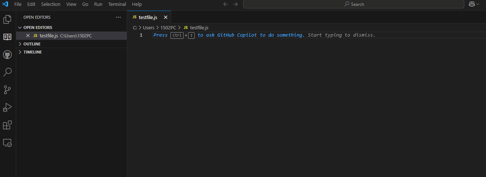

# Quick Snippets for JavaScript, React, TypeScript, and Vue Extension

A convenient Visual Studio Code extension providing a curated set of **snippets** for:

- **JavaScript** (ES6+)
- **TypeScript**
- **React** (JS/TS)
- **Vue 3 (Composition API)**

This extension aims to help developers quickly scaffold boilerplate code in a consistent, idiomatic way.

---

## Features

1. **JavaScript Snippets**  
   Common patterns like for loops, arrow functions, console logging, and fetch requests.

2. **TypeScript Snippets**  
   Interfaces, type aliases, enums, classes, and typed async functions.

3. **React Snippets**  
   Functional components (JS/TS), hooks (`useState`, `useEffect`), context creation, React Router boilerplate.

4. **Vue Snippets (Composition API)**  
   Focused on Vue 3 with `<script setup>`, reactivity (`ref`, `computed`), lifecycle hooks, typed props/emits, etc.

---

## Installation

1. **From VS Code Marketplace (Recommended)**

   - Open **Extensions** in VS Code (Ctrl+Shift+X or Cmd+Shift+X).
   - Search for "**Quick Snippets for JavaScript, React, TypeScript, and Vue**".
   - Click **Install**.
     OR visit [Marketplace](https://marketplace.visualstudio.com/items?itemName=YAKAZAKI.quick-snip-js) to install.

2. **From `.vsix` file (Offline)**
   - Download the `.vsix` file (from [Releases](#) or a direct link).
   - In VS Code, go to **Extensions** → **...** → **Install from VSIX**.
   - Select the downloaded file.

---

## Usage

1. **Open a file** in your language of choice:

   - JavaScript (`.js`)
   - TypeScript (`.ts`)
   - React (`.jsx` / `.tsx`)
   - Vue (`.vue`)

2. **Type one of the snippet prefixes** (e.g. `cl`, `iface`, `rfc`, `vue-sfc`, etc.).
3. **Press `Tab`** (or `Enter`) to expand the snippet.
4. **Tab through placeholders** to quickly fill in variable names, function parameters, or other details.

---

## Example

Here’s a quick demo of how the **Quick Snippets for JavaScript, React, TypeScript, and Vue** extension works:

---

## Snippet Reference

### **Standardized Prefix List**

| **Prefix**     | **Description**                   | **Languages**  |
| -------------- | --------------------------------- | -------------- |
| `cl`           | `console.log()`                   | JS, TS, Vue    |
| `clm`          | Log multiple variables            | JS, TS, Vue    |
| `afn`          | Arrow function                    | JS, TS, Vue    |
| `afna`         | Async arrow function              | JS, TS         |
| `fn`           | Function declaration              | JS, TS, Vue    |
| `iife`         | Immediately Invoked Function      | JS, TS         |
| `forloop`      | Classic for loop                  | JS, TS, Vue    |
| `forof`        | For...of loop                     | JS, TS         |
| `fetchget`     | Fetch API (GET request)           | JS, TS         |
| `tryc`         | Try/catch block                   | JS, TS         |
| `sto`          | Set timeout                       | JS, TS, Vue    |
| `rfc`          | React functional component        | JS, TS (React) |
| `rfc-ts`       | React functional component (TS)   | TS (React)     |
| `usest`        | React `useState` hook             | JS, TS (React) |
| `useeff`       | React `useEffect` hook            | JS, TS (React) |
| `usectx`       | React `useContext` hook           | JS, TS (React) |
| `rchook`       | Create a React hook               | JS, TS (React) |
| `rmemo`        | Memoized component (`React.memo`) | JS, TS (React) |
| `usered`       | React `useReducer` hook           | JS, TS (React) |
| `vue-sfc`      | Vue SFC `<script setup>` template | Vue            |
| `vref`         | Vue `ref()`                       | Vue            |
| `vcomputed`    | Vue `computed()`                  | Vue            |
| `vwatch`       | Vue `watch()`                     | Vue            |
| `vwatcheffect` | Vue `watchEffect()`               | Vue            |
| `vonmounted`   | Vue `onMounted()`                 | Vue            |
| `vonunmounted` | Vue `onUnmounted()`               | Vue            |
| `iface`        | TypeScript interface              | TS             |
| `tclass`       | TypeScript class                  | TS             |
| `tfunc`        | Typed function                    | TS             |
| `talias`       | Type alias                        | TS             |
| `tenum`        | Enum declaration                  | TS             |
| `tasync`       | Async function with return type   | TS             |
| `tgen`         | Generic function                  | TS             |

---

## Contributing

1. **Fork** the ([Repository](https://github.com/nepalibidur14/vs-quicksnippet)).
2. **Add or edit snippets** in their respective JSON files.
3. **Submit a pull request** with your changes.

We welcome snippets for additional frameworks, advanced language features, or any repetitive patterns!

---

## License

Licensed under the [MIT License](LICENSE.md). Feel free to reuse or modify this extension in your own projects.

---

## Feedback & Support

- **Bugs or feature requests?**  
  [Open an issue](https://github.com/nepalibidur14/vs-quicksnippet/issues).
- **Enjoying it?**  
  Please leave a [rating or review](https://marketplace.visualstudio.com/items?itemName=YAKAZAKI.quick-snip-js&ssr=false#review-details) in the VS Code Marketplace!

---

### If you enjoy using Quick Snippets, please consider [leaving a review](https://marketplace.visualstudio.com/items?itemName=YAKAZAKI.quick-snip-js)!

### Happy Coding with JavaScript, TypeScript, React, and Vue 3 Composition API!
